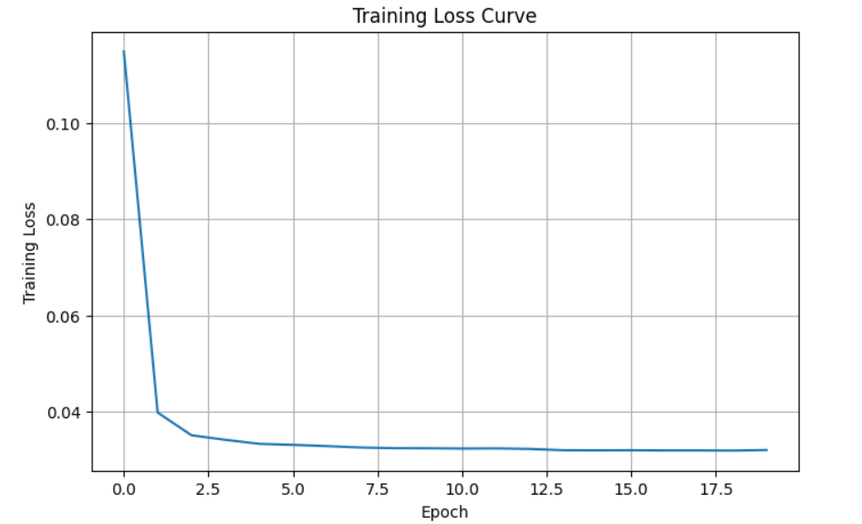
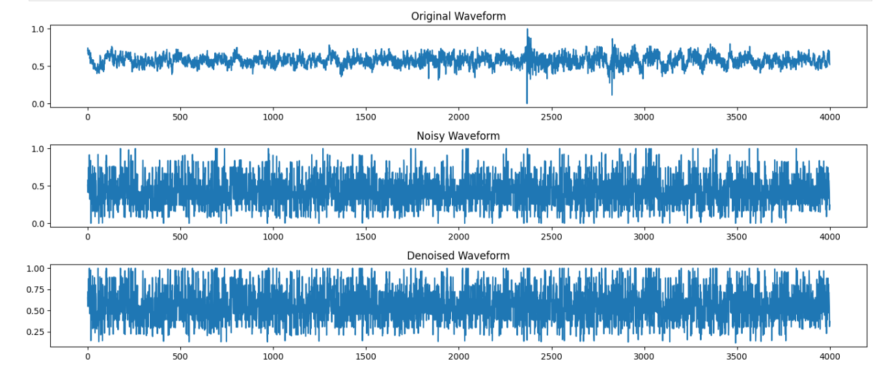

# SpikePoissonDiffusion  
### Diffusion-Inspired Audio Denoising using Spiking Neural Networks

SpikePoissonDiffusion is an experimental deep learning project that explores diffusion-inspired audio denoising using Spiking Neural Networks (SNNs).

The project investigates whether spike-based temporal neural processing can learn to reconstruct cleaner audio waveforms from stochastic corruption generated through Poisson-based noise injection.

Rather than focusing on large-scale speech generation, this work studies the interaction between:

- diffusion-style corruption processes
- spike-based temporal computation
- waveform reconstruction learning

using lightweight spiking neural architectures.

---

# Project Motivation

Diffusion models have shown strong performance in denoising and reconstruction tasks by learning to reverse progressive corruption processes.

At the same time, Spiking Neural Networks process information through discrete spike activity and temporal membrane dynamics, making them biologically inspired alternatives to conventional neural networks.

This project explores whether spike-driven neural processing can learn diffusion-inspired audio denoising behavior on noisy waveform data.

The work is intended as an exploratory research implementation rather than a production-scale speech restoration system.

---

# Objectives

The main objectives of this implementation are:

- Implement a diffusion-inspired waveform corruption process
- Introduce Poisson-based stochastic noise injection
- Train a spiking neural network for corruption prediction
- Reconstruct cleaner audio waveforms from noisy inputs
- Evaluate waveform denoising performance quantitatively and visually

---

# Methodology

## Forward Corruption Process

The forward corruption stage progressively degrades audio waveforms using Poisson-based stochastic corruption combined with Gaussian perturbation.

At higher diffusion timesteps, the waveform becomes increasingly corrupted.

The corruption process includes:

- Poisson spike-like stochastic noise
- timestep-dependent corruption intensity
- additional Gaussian perturbation
- waveform normalization and clipping

This setup is designed to simulate a diffusion-inspired degradation process for waveform denoising experiments.

---

## Spiking Neural Network Architecture

The denoising model is implemented using a lightweight Spiking Neural Network composed of:

- timestep conditioning module
- fully connected processing layers
- Leaky Integrate-and-Fire (LIF) neurons
- rate-based spike encoding
- temporal spike simulation

The model receives:

- a noisy waveform
- the current diffusion timestep

and predicts the corruption injected into the waveform.

---

## Timestep Conditioning

Diffusion timesteps are encoded using a small multilayer perceptron (MLP).

The generated timestep embedding is added to the noisy waveform before spike encoding, allowing the network to adapt its denoising behavior according to corruption intensity.

---

## Spike-Based Processing

The conditioned waveform is converted into spike trains using rate encoding.

Spike activity is processed across multiple temporal simulation steps using:

- fully connected layers
- LIF neurons
- membrane state dynamics

The outputs across simulation steps are averaged to generate the final corruption prediction.

---

# Dataset

The project uses the SpeechCommands dataset from `torchaudio`.

Preprocessing includes:

- waveform resampling
- mono conversion
- fixed-length cropping/padding
- min-max normalization

A smaller subset of the dataset is used to keep experimentation computationally manageable.

---

# Technologies Used

```python
Python
PyTorch
snntorch
torchaudio
NumPy
Matplotlib
soundfile
```

---

# Training Strategy

During training:

1. Random diffusion timesteps are sampled
2. Poisson-based corruption is injected into clean waveforms
3. The noisy waveform is passed through the SNN
4. The network predicts the injected corruption
5. Mean Squared Error (MSE) loss is minimized

### Optimization Setup

- Optimizer: AdamW
- Loss Function: MSE Loss
- Gradient Clipping for stability

---

# Experimental Results

After training, the model demonstrated measurable denoising behavior on unseen waveform samples.

### Evaluation Results

```text
Test Noise Prediction Loss : 0.03171
Noisy Waveform MSE         : 0.04826
Denoised Waveform MSE      : 0.03069
```

The denoised waveforms showed lower reconstruction error compared to corrupted inputs.

---

# Results

## Training Loss



## Waveform Reconstruction


## Noisy vs Denoised



---

# Key Observations

- The spiking network learned to predict stochastic corruption patterns
- Denoised waveforms achieved lower reconstruction error than noisy inputs
- Temporal spike dynamics were able to participate in waveform restoration behavior
- Timestep conditioning improved denoising adaptation across corruption levels

---

# Limitations

This work is exploratory and has several limitations:

- Uses a lightweight fully connected architecture
- Reconstruction quality remains limited
- Full reverse diffusion sampling is not implemented
- Spike simulation increases computational cost
- Experiments are limited to smaller waveform subsets

---

# Future Directions

Possible future improvements include:

- deeper spiking architectures
- convolutional or recurrent spike models
- improved diffusion schedules
- spike-based generative sampling
- spectrogram-domain denoising
- hybrid ANN-SNN systems
- neuromorphic hardware deployment

---

# Research Perspective

This project was developed as an exploratory study at the intersection of:

- Spiking Neural Networks
- Diffusion-inspired learning
- Temporal neural computation
- Audio waveform denoising

The primary goal was to investigate whether spike-based neural systems can meaningfully participate in diffusion-style reconstruction tasks for noisy waveform data.

---

# Repository Structure

```text
SpikePoissonDiffusion/
│
├── SpikePoissonDiffusion.ipynb
├── README.md
├── LICENSE
├── requirements.txt
└── results/
    ├── training_loss.png
    ├── waveform_denoising.png
    └── noisy_vs_denoised.png
```

---

# Conclusion

This project demonstrates that diffusion-inspired audio denoising can be explored using Spiking Neural Networks operating on waveform data.

The results suggest that spike-based temporal processing can learn basic corruption prediction and waveform reconstruction behavior, while providing a foundation for future research into neuromorphic diffusion systems for audio restoration.
